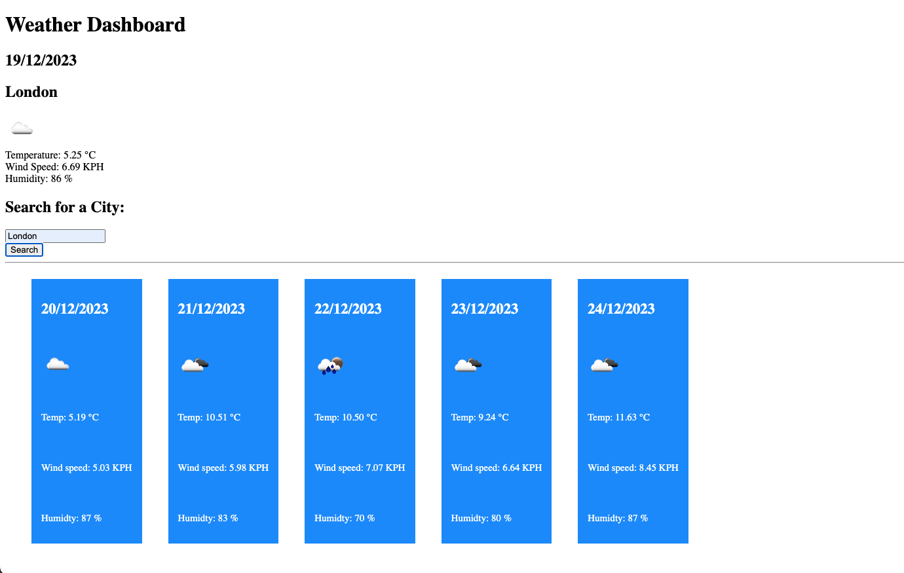

# Weather-Dashboard

## Description
This is a weather dashboard that can be used to check the current weather and forecasted weather for a specific city.
The weather data is obtained from the OpenWeatherMap open API using the city coordinates.

## Installation
No installation required.

## Usage
To access the application the user needs to navigate to [Weather Dashboard](https://naike-b.github.io/Weather-Dashboard/).  

The user can search a city entering the city name in the search bar and clickin on the button "Search".
Then the weather for the current date and for the following 5 days is displayed for the city selected.
The information displayed includes:
- Date
- Weather icon
- Temperature in Celsius
- Wind Speed in KPH
- Humidity in %

The cities searched are visible on the page in the form of buttons that can be clicked to get the weather information. 

This is what the application looks like:

## License
Please refer to the license in the repository.

## Credits

I want to express my gratitude to my instructor, my teaching assistant and my tutors and my study group. They were very helpful and provided me with a lot of support while working on this application.